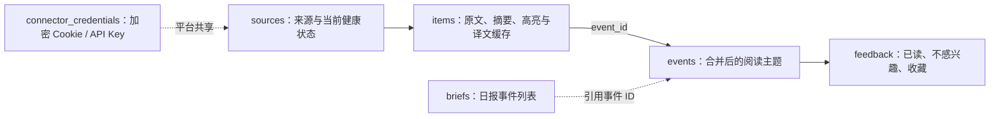
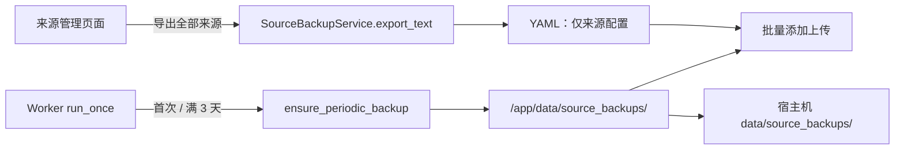

# 2026-08-04 迭代记录：SQLite v7 与来源可恢复备份

> 分支：`main`
> 提交主题：`feat: simplify sqlite migration and preserve source backups`
> 状态：已实现、已完成自动化回归验证
> 适用部署目录：`/home/jzb/docker/rss-hub`
>
> 后续说明：本文记录 v6 → v7 完成后固定结构的历史状态。随后 v8 整合因新增全局抓取排期和媒体字段，按明确授权恢复了仅用于该次升级的显式迁移路径；当前部署步骤以 [v8 整合记录](INTEGRATION_2026-08-04_FETCH_MEDIA_FAVORITES.md) 和 [SQLite 结构精简与安全迁移说明](SQLITE_SCHEMA_AND_MIGRATION.md) 为准。

## 1. 本次迭代解决什么问题

这次不是单独增加一个“导出来源”按钮，而是完成一组相互关联的稳定性优化：

1. 旧 SQLite 结构存在重复关系、无限增长的运行记录和未使用字段，维护成本高，事件合并后也容易留下冗余状态。
2. 服务器上的 SQLite 已运行一段时间，不能用本地数据库覆盖，也不能让 Web 或 Worker 在启动时悄悄重建表。
3. 用户在网页维护的来源只存在于 SQLite；部署、迁移或误操作前需要一个可下载、可恢复、不会泄露凭据的来源清单。
4. 导出的“全部来源”必须能直接回传到既有的“批量添加”入口，否则备份文件无法成为真正的恢复工具。
5. 同一产品的不同消息过去可能被过度合并；产品名相同不等于同一件现实事件。

## 2. 变更概览

| 范围 | 改动 | 优化的问题 |
| --- | --- | --- |
| SQLite v7 | 收敛为 6 张业务表，以 `items.event_id` 作为内容归属的唯一事实来源 | 移除 `event_items` 的重复关系，避免事件与条目关系不一致 |
| 历史运行记录 | 移除 `fetch_runs`、`curation_runs` 的持久化 | 避免每轮 Worker 无限写入无页面消费者的历史记录 |
| 来源模型 | 删除未使用的备用链接字段，保留归档、启停、抓取频率与当前健康状态 | 让来源表只承担“去哪里抓、如何抓、当前是否可用” |
| 事件展示 | 来源数量按当前可见 `items` 实时计算 | 消除缓存 `source_count` 在暂停、归档或合并后可能过期的问题 |
| 一次性升级 | 完成 v6 → v7 升级后删除临时迁移逻辑 | 避免一次性维护代码干扰 Portainer 的日常部署 |
| 来源导出 | 新增“导出全部来源”YAML 下载 | 用户可以在部署前或任意时点保留当前来源清单 |
| 自动快照 | Worker 首次运行创建快照，之后每 3 天最多一次，保留 5 份 | 避免长期依赖单一 SQLite 文件保存来源配置 |
| 批量恢复 | 导出/快照 YAML 可直接上传到“批量添加” | 备份文件可用于恢复，不需要手工逐条重录 |
| 筛选策略 | 项目 Skill 增加“同一事件”的明确共同锚点门槛 | 防止只因同一产品或同一领域就合并独立消息 |

## 3. 核心实现

### 3.1 SQLite v7：最小化但不丢失当前能力

目标结构保留以下 6 张业务表：



- `items.event_id` 取代 `event_items`：一条内容最多归属一个事件，符合当前产品规则。
- `sources` 保留 `feed_url` 和少量非敏感 `config_json`：前者供连接器使用，后者仅用于如 X 用户 ID 的缓存；Cookie、API Key 不允许进入该字段。
- `feedback` 使用 `(event_id, action)` 复合主键：同一事件同一状态只有一份事实，支持 `read`、`not_interested` 与 `saved`。
- `fetch_runs`、`curation_runs` 不再写库：来源表的最后成功时间、错误和健康状态已经满足当前页面与运维需求，详细故障看 Docker 日志即可。

### 3.2 一次性升级完成后，回归固定 v7 结构

v6 → v7 是当前唯一一次历史结构升级，已在 2026-08-04 完成并创建一致性备份。由于项目只供当前单用户使用，升级完成后删除了 `app.migrate`、`--check`、`--apply` 和 Compose 维护 profile。

- `Database.initialize()` 只允许空库初始化为 v7，或打开已经是 v7 的库；
- 发现旧结构时，普通 Web/Worker 会明确拒绝启动，不会修改线上文件；
- 日常代码更新只需在 Portainer 点击“从 Git 仓库重新部署”，没有额外迁移容器或终端操作；
- 未来如果确实需要破坏性结构变更，应为当次升级单独设计、验证和执行一次方案，不预先保留通用迁移框架。

### 3.3 来源导出、自动快照与恢复

调用链：



`SourceBackupService` 只输出以下字段：

```yaml
version: 1
exported_at: "2026-08-04T09:30:00+00:00"
sources:
  - name: "OpenAI"
    kind: x_rsshub
    locator: "OpenAI"
    official: true
    enabled: true
    archived: false
    poll_interval_minutes: 60
```

明确不会写入：

- Cookie、API Key、加密密文或指纹；
- `feed_url`、连接器缓存、抓取状态、错误日志；
- 已抓取的内容、事件、已读状态或用户反馈。

实现细节与取舍：

- 快照使用临时文件加 `os.replace()` 原子落盘，避免下载到半写入的 YAML。
- 目录固定为 `settings.data_dir / source_backups`。Docker 中是 `/app/data/source_backups/`，由现有 Compose 挂载到宿主机 `/home/jzb/docker/rss-hub/data/source_backups/`，不需要为备份新建 SQLite 表。
- 快照文件名携带 UTC 时间戳，并以文件名时间判断 3 天间隔和“最新 5 份”。不能只依赖文件 `mtime`，因为复制、恢复或宿主机操作可能改变 `mtime` 并导致计划误判。
- 写快照发生 `OSError` 时只记录 Worker 日志，不阻断本轮抓取、摘要和筛选。
- 页面下载历史快照前严格校验文件名，阻断路径穿越。

### 3.4 批量添加兼容恢复文件

- 批量导入器识别导出文件中的 `archived`；归档来源恢复后仍保持归档和停用。
- `enabled`、`official`、`poll_interval_minutes` 均可恢复。
- 导出文件的顶层 `version`、`exported_at` 仅作描述，现有 YAML 导入器会安全忽略，不影响旧格式导入。
- 同一 `(kind, locator)` 已存在时安全跳过，不覆盖正在使用的来源。
- 单次上限从 100 提升为 1000 条，配合 1 MB 文件上限，使“导出全部来源后直接回传”在个人部署中成立。
- 恢复来源不恢复平台凭据；导入后仍需要在“设置与连接”中维护 X Cookie、模型连接等凭据。

### 3.5 筛选合并规则收紧

项目级 `curate-personal-news` Skill 现在要求消息同时具有：同一主体或产品、同一项具体变化、摘要可见的共同事件锚点，才能合并。

共同产品名、公司名、领域或用户兴趣并不构成共同事件锚点。信息不明确时，宁可分别保留，不推测合并。这解决了“实操经验、教程、产品趋势观点因出现同一产品名被合并”的问题。

## 4. 文件与职责

| 文件 | 本次职责 |
| --- | --- |
| `app/storage/migrations.py` | 定义固定 v7 目标结构、空库初始化与已有结构校验 |
| `app/storage/database.py` | 禁止旧结构在普通运行时自动升级 |
| `app/storage/repository.py` | 使用 `items.event_id`、动态来源数和复合反馈主键 |
| `app/services/source_backups.py` | 来源 YAML 导出、定期快照、保留 5 份、下载路径保护 |
| `app/services/pipeline.py` | Worker 每轮开头触发非阻断式来源快照检查 |
| `app/services/batch_sources.py` | 解析归档状态，支持恢复文件与 1000 条导入 |
| `app/web.py`、`app/templates/sources.html` | 导出路由、历史快照下载和来源管理页面展示 |
| `docker-compose.yml` | 仅定义 Portainer 日常运行所需的 Web 与 Worker |
| `.agents/skills/curate-personal-news/SKILL.md` | 收紧同一事件的合并前置条件 |
| `tests/` | 覆盖迁移、来源导出回传、快照留存、下载路由和现有页面行为 |

## 5. 部署与恢复说明

当前服务器已经完成 v7 升级。后续部署只在 Portainer 的 `new-rss-hub` Stack 页面点击“从 Git 仓库重新部署”，无需在 `/home/jzb/docker/rss-hub` 执行 Git、Docker 或迁移命令。

日常运行中：

1. Worker 下一轮会创建第一份来源快照；无需额外定时任务。
2. 在“来源管理”可立即下载“导出全部来源”，或下载任一历史快照。
3. 需要恢复时，打开“批量添加”，直接上传 YAML；然后按平台重新验证必要凭据。

## 6. 验证结果

- 完整自动化测试：以当前代码执行结果为准。
- 新增覆盖：导出 YAML 不泄露连接器缓存或抓取地址；可在空数据库中回传；暂停、归档和轮询间隔保持一致；首次备份、3 天间隔、5 份留存、路径校验和 Web 下载均通过。
- SQLite 覆盖：空库初始化、已有 v7 正常启动、旧库拒绝普通启动，以及不完整 v7 拒绝自动修复。

## 7. 已知边界

- 自动来源快照依赖 Worker 正常运行；Worker 停止期间不会产生时间驱动的备份，恢复运行后的下一轮会继续检查。
- 快照是“来源配置恢复”，不是完整数据库灾备。资讯、事件、已读、收藏和凭据仍由 SQLite 数据库备份/迁移备份承担。
- YAML 重新上传只新增不存在的来源，不会以旧备份覆盖当前已经编辑过的同一来源，避免恢复操作误改线上配置。
- 当前版本不包含迁移命令；发现旧结构会拒绝启动，而不会在 Portainer 日常部署中修改历史数据。

## 8. 一次性日报修复记录

升级时发现日报列表中有 1 个已经不存在的事件 ID。一次性升级仅移除了这个失效引用，保留日报行、其余有效事件 ID 和所有资讯数据。该修复已随 v7 升级完成，相关预检、自动修复和 CLI 代码不再保留在日常项目中。
