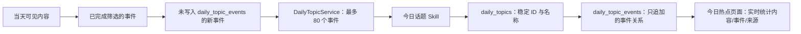

# 2026-08-05：今日热点与 SQLite v11

## 目标

将原来的“本周热点全量重算”改为“今日热点增量归并”。时间范围固定为配置时区的当天 `00:00 → 当前时刻`，不是滚动 24 小时。

事件第一次进入今日窗口时会获得话题归属；成功归属后不会在当天被重排、挪到其他话题或改写既有话题名称。后续同一事件增加内容时，页面只从真实内容关系实时增加条数，不再请求话题模型。

## 处理链路



`topics` 仍是独立 Worker，不增加 Docker 服务或容器。它启动时立即执行，之后默认每 30 分钟执行一次，可在“设置与连接 → 今日热点刷新”调整为 5–1440 分钟。

## 模型输入与输出

每次请求只包含：

- 最多 80 个当天尚未归属的事件；每个事件只传 `id`、最多 30 字标题、最多 100 字事实摘要；
- 当天已有话题的 `id` 和最多 30 字展示名；不再传它们的全部事件 ID；
- 日期和时区。

输入示例：

```json
{
  "day": {"date": "2026-08-05", "timezone": "Asia/Shanghai"},
  "existing_topics": [
    {"id": 42, "display_name": "MiniMax-M3 发布与评测"}
  ],
  "new_events": [
    {"id": 101, "title": "MiniMax-M3 新评测", "summary": "评测给出速度和能力结论。"}
  ]
}
```

输出仍是强制 JSON，便于程序校验：

```json
{
  "topics": [
    {"ref": "existing:42", "event_ids": [101]},
    {
      "ref": "new:1",
      "display_name": "海螺新模型发布与对比",
      "event_ids": [102, 103]
    }
  ]
}
```

`existing:42` 是数据库已有的稳定话题 ID，不能附带或改写 `display_name`。`new:1` 仅是本次模型请求中的临时引用，服务层会创建真实数据库 ID。输出会校验每个新事件是否恰好出现一次、既有 ID 是否真实存在；校验失败不会写入任何关系。

## 数据结构与迁移

v11 在完整 v10 数据库上只追加以下两张表和索引，不删除旧 `weekly_topics` 数据：

| 表 | 用途 |
| --- | --- |
| `daily_topics` | 当天话题的数据库 ID、自然日和固定展示名 |
| `daily_topic_events` | 当天话题与事件的只追加关系；同一事件同一天只能归属一个话题 |

发布前必须停止 `web`、`collector`、`processor`、`topics`，然后执行：

```bash
docker compose down
docker compose --profile maintenance build migrate
docker compose --profile maintenance run --rm migrate --check
docker compose --profile maintenance run --rm migrate --apply
docker compose up -d --build
```

`--check` 只读预检。`--apply` 先使用 SQLite `backup()` API 在持久化 `data/backups/` 创建一致性备份，再执行单事务迁移和迁移后校验。迁移后今日表从空开始，Worker 会在下一轮按新的当天增量规则建立话题；旧周话题表保留但不再供页面读取。

## 失败处理与已知代价

- 模型、Skill 或网络失败时，已成功写入的当天归属保留；尚未归属的事件在后续轮次重试。
- 为避免异常高峰重现超大请求，每次最多处理 80 个新事件。若一天首次积压超过该数量，剩余事件不会丢失，会在后续 30 分钟轮次继续处理。
- 话题热度是订阅源中当天真实可见内容的覆盖量，不是全网热搜指数；隐藏内容和已停用来源不计入统计。
