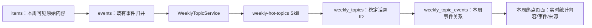

# 2026-08-05：本周热点与 SQLite v10

## 目标

用“本周热点”替代每日简报入口。热点以本周可见内容条数排序，同时展示独立事件数和来源数；累计不足 2 条内容的事件不显示为热点。它表示当前订阅源中的报道覆盖量，不伪装成全网热搜指数。

## 处理链路



事件仍是“同一次具体现实变化”的合并结果；话题是本周内多个相关事件的阅读组织层。话题展示名可以更新，例如从“MiniMax-M3 发布”更新为“MiniMax-M3 发布与评测”，但数据库 `weekly_topics.id` 不会因改名而变化。

## 归并边界

- 只扫描配置时区中本周周一零点至当前时刻的内容。
- 只纳入 `must_read`、`important`、`brief` 事件。
- `editorial_tier = hidden` 与用户 `not_interested` 的事件不传给话题 Skill，也不计入统计。
- 单条内容仍作为独立事件正常处理；仅累计至少 2 条可见内容的话题会进入本周热点页面。
- 事件必须且只能属于本周的一个话题；同一事件下多条报道增加内容数，不会制造多个事件。
- 仅因公司或领域相同不得合并。展示名优先使用“具体对象 + 当前叙事”，而不是宽泛公司名。
- 话题 Skill 只返回事件归属与展示名。内容数、事件数、来源数均由 SQLite 从真实关系实时计算。
- 为控制模型请求体，每个事件只传 `id`、最多 30 字的标题和最多 100 字的摘要；标题或摘要过长时优先在完整句末截断，不传原始正文或统计字段。内容统计只在累计跨过“2 条可展示内容”门槛时触发一次归并，普通热度变化不请求模型。

## 数据结构

v10 新增两张表，不修改 `items`、`events` 或历史 `briefs`：

| 表 | 用途 |
| --- | --- |
| `weekly_topics` | 本周话题的数据库 ID、周起始日、可变展示名、创建和更新时间 |
| `weekly_topic_events` | 某个周话题包含的事件；约束同一事件在同一周只能归入一个话题 |

每日简报表和历史路由暂时保留，便于回看既有数据；Worker 不再生成新的日报，主导航改为“本周热点”。后续如确认历史日报不再需要，再单独做删除迁移，避免与本次功能迁移混在一起。

## v9 → v10 迁移与部署

迁移为纯加法：在完整 v9 数据库上单事务创建两张表及索引，写入 `PRAGMA user_version = 10`。已有来源、内容、事件、反馈、凭证和日报数据不会被重建。

发布前必须停止 `web`、`collector`、`processor`、`topics`。不要手工复制仍在 WAL 模式运行的 `.db` 文件，也不要在 sqlite shell 中手工建表。

如果服务器上有 Compose 项目目录：

```bash
docker compose down
docker compose --profile maintenance build migrate
docker compose --profile maintenance run --rm migrate --check
docker compose --profile maintenance run --rm migrate --apply
docker compose up -d --build
```

`--check` 只读执行完整性、外键、版本与结构预检。`--apply` 会先通过 SQLite `backup()` API 在持久化 `data/backups/` 目录创建一致性备份，再执行迁移和迁移后校验。完整 v9 库走加法迁移；v8 及更早的已知结构通过同一维护命令走安全重建路径直接升级到 v10。不要跳过预检。

新服务启动后，独立的 `topics` Worker 会立即扫描当前周的可见事件并生成首份话题快照，不再等待 Processor 的摘要、筛选或翻译批次结束。默认每 30 分钟执行一次，可在网页“设置与连接 → 本周热点刷新”中调整为 5–1440 分钟；候选发生变化时模型仍最多每 5 分钟调用一次。单条内容不会成为可展示热点。模型或话题 Skill 暂不可用时，不会修改上次成功快照，也不会回退为关键词统计。
