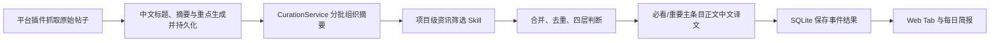
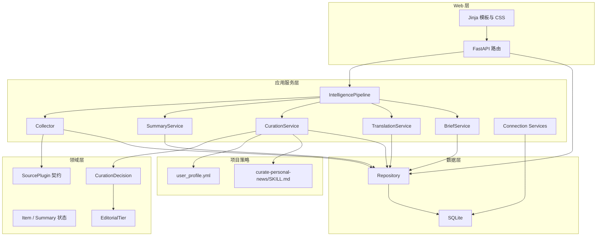
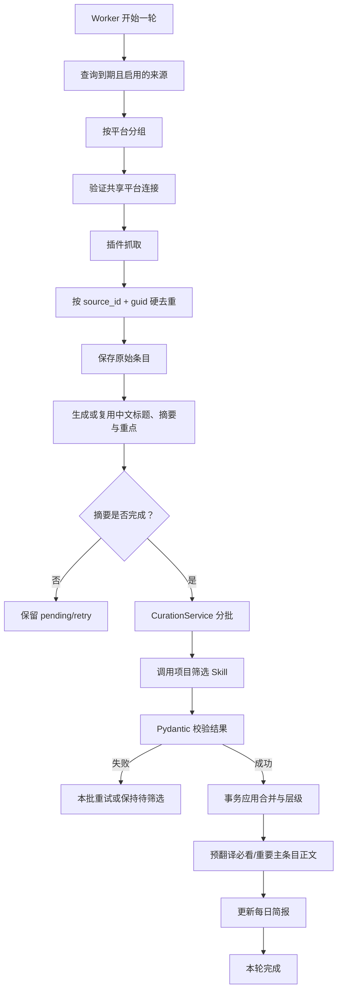
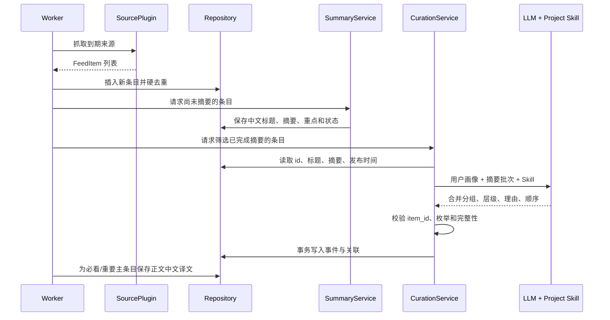
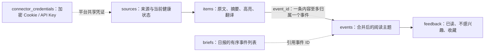
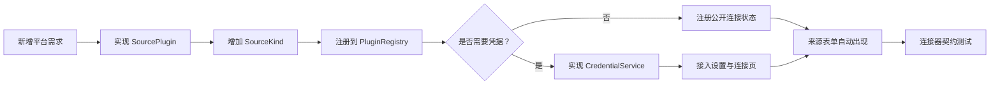

# NewsRSSHub 产品需求与目标架构设计

> 2026-08-04 更新：当前实现的数据库精简目标、六表模型、线上预检/备份/显式迁移流程以 [SQLite 结构精简与安全迁移说明](SQLITE_SCHEMA_AND_MIGRATION.md) 为准；本文中与旧 `event_items`、`fetch_runs`、`curation_runs` 或自动重建迁移冲突的描述均由该说明覆盖。

> 文档版本：v1.2
> 文档状态：已进入实现与验证  
> 更新时间：2026-08-04
> 适用范围：单用户、私有部署的 NewsRSSHub

本文档是本阶段实现的需求与架构基线。它同时说明当前系统已经具备什么、哪些旧机制需要删除、目标系统应如何运行。核心代码已按本文档进入实现与自动化验证；部署环境仍需在目标 Docker 主机完成最终验收。

## 目录

1. [产品摘要](#1-产品摘要)
2. [产品背景与当前问题](#2-产品背景与当前问题)
3. [产品定位](#3-产品定位)
4. [产品原则](#4-产品原则)
5. [当前实现与目标差异](#5-当前实现与目标差异)
6. [功能需求](#6-功能需求)
7. [信息架构](#7-信息架构)
8. [目标架构](#8-目标架构)
9. [核心处理流程](#9-核心处理流程)
10. [运行时 Skill 集成](#10-运行时-skill-集成)
11. [数据模型](#11-数据模型)
12. [Web 查询与页面职责](#12-web-查询与页面职责)
13. [插件化来源架构](#13-插件化来源架构)
14. [配置、凭据与安全](#14-配置凭据与安全)
15. [Docker 与部署](#15-docker-与部署)
16. [数据库迁移策略](#16-数据库迁移策略)
17. [失败、重试与幂等](#17-失败重试与幂等)
18. [性能与 Token 控制](#18-性能与-token-控制)
19. [测试方案](#19-测试方案)
20. [验收标准](#20-验收标准)
21. [实施计划](#21-实施计划)
22. [预计修改文件](#22-预计修改文件)
23. [已确定的产品决策](#23-已确定的产品决策)
24. [待用户评审的建议](#24-待用户评审的建议)

---

## 1. 产品摘要

NewsRSSHub 是一个面向个人使用的每日情报台。它从 RSS、X、Reddit 等来源持续抓取内容，先为每条原始帖子生成简洁摘要，再由项目级资讯筛选 Skill 完成同一事件合并、重复去除和四层内容判断，最终通过 Web 页面呈现真正值得阅读的内容。

产品不追求“收集得最多”，而追求：

1. 重要消息不能被普通资讯淹没。
2. 同一件事不重复展示。
3. 用户能够快速区分“今天必须看”和“知道有这回事即可”。
4. 用户不需要维护关键词、权重、评分公式和静态黑名单。
5. 新增平台、模型能力或页面功能时，不破坏现有模块。

目标主流程：



---

## 2. 产品背景与当前问题

### 2.1 用户痛点

当前信息源数量较多，一天可能抓取数百条内容。简单按账号优先级、关键词命中和发布时间排序，会产生以下问题：

- “相关”被误认为“重要”。
- 普通 LoRA、教程、营销演示挤占重要位置。
- 顶级模型发布、服务下线和 Codex 调整没有稳定进入必看区域。
- 同一事件被不同账号反复发布，首页出现多张内容相似的卡片。
- 模型生成的“为何值得看”重复摘要，缺少实际信息。
- 旧主题分类过于宽泛，“全部主题”筛选没有实际价值。
- 数字分数看似精确，实际上无法准确表达用户对一条资讯的真实重视程度。

### 2.2 目标变化

目标系统不再回答“这条消息得多少分”，而直接回答：

1. 这几条消息是否在讲同一件事？
2. 是否存在真正新增的信息？
3. 对当前用户而言，它属于必看、重要更新、资讯速览还是隐藏归档？
4. 在同一层中，哪一条应当先展示？

---

## 3. 产品定位

### 3.1 目标用户

- 单一用户。
- AI 算法工程师、AI 产品从业者。
- 关注大模型、Codex、ComfyUI、AI 视频、游戏开发、个人开发、模型评测与踩坑。
- 同时关注部分理财、科技公司和商业趋势信息。
- 希望每天打开一个网页，用较短时间完成资讯复盘。

### 3.2 核心使用场景

1. 早上或空闲时打开首页，先查看“必看”。
2. 查看对工作有帮助但不紧急的“重要更新”。
3. 快速扫过“资讯速览”的标题。
4. 点击某条内容查看摘要、原始链接和被合并的来源。
5. 对误判内容点击“不感兴趣”，或在“已隐藏”中恢复。
6. 在 Web 中增加、暂停、测试或归档来源。
7. 在 Web 中更新 X Cookie、模型 API Key、Base URL 和模型名称。
8. Cookie 或模型连接失效时，在首页和设置页看到明确提醒。

### 3.3 非目标

当前版本不做以下内容：

- 多用户、团队权限或公开社区。
- 使用关键词、兴趣权重或数值评分推荐内容。
- 自动交易、投资建议或自动执行外部操作。
- 秒级实时推送；产品定位是分钟至小时级的个人情报台。
- 将所有原始正文一次性发送给筛选模型。
- 为每条普通资讯生成冗长的模型解读。

---

## 4. 产品原则

### 4.1 摘要先于筛选

每条原始帖子必须先得到独立摘要。筛选 Skill 接收的是摘要，不是原文。

筛选输入固定为业务层提供的最小信息：

```json
{
  "id": 123,
  "title": "原始标题",
  "summary": "抓取阶段生成并保存的摘要",
  "published_at": "ISO-8601 发布时间"
}
```

用户自然语言画像作为独立上下文同时提供。作者、账号、平台、链接和原文不作为单独筛选字段；如果“官方发布”对理解有必要，应由摘要明确表达。

### 4.2 Skill 只负责内容判断

项目级 Skill 只负责：

1. 合并同一件事。
2. 去掉没有新增信息的重复消息。
3. 判断四个内容层级。

以下职责不属于 Skill：

- 抓取内容。
- 生成摘要。
- 决定每批传入多少条。
- 定义 JSON 或数据库结构。
- 写入 SQLite。
- 决定 Web 页面如何展示。

这些职责分别由抓取插件、摘要服务、CurationService、领域模型、Repository 和 Web 层完成。

### 4.3 自然语言画像

`sources/user_profile.yml` 只保留自然语言画像。系统整体理解画像，不将其转换成关键词列表、实体白名单或固定的“如果……那么……”规则。

### 4.4 不使用相关性分数

目标系统不生成或展示 `relevance_score`、`importance_score`、星级、百分比等数值。

同一层内部需要稳定顺序时，保存 `curation_order`。它只表示最终先后位置，不表达一个伪精确的价值分数。

### 4.5 原始数据可追溯

筛选和合并不会删除原始帖子。每个事件必须能够追溯到原始条目和原始链接。模型误判后可以恢复或重新筛选。

---

## 5. 当前实现与目标差异

| 能力 | 当前状态 | 目标状态 |
| --- | --- | --- |
| RSS、X、Reddit 插件 | 已实现 | 保留插件接口，后续可增加 YouTube |
| 来源添加、测试、启停、归档 | 已实现 | 保留 |
| X Cookie Web 配置与校验 | 已实现 | 保留，抓取前继续校验 |
| 模型连接 Web 配置与测试 | 已实现 | 保留 |
| SQLite 持久化 | 已实现 | 增加版本化迁移和新字段 |
| 单帖摘要 | 未完整实现；当前主要是事件初步合并后生成摘要 | 调整为每条帖子在筛选前都有摘要 |
| 事件合并 | 标题指纹和词面相似度 | 改为 Skill 根据摘要语义合并 |
| 内容选择 | 关键词、来源优先级和数字评分 | 改为四层语义判断 |
| 模型分析 | 逐事件生成摘要、为何重要、事实和观察点 | 摘要与筛选分离；普通资讯不生成泛化解读 |
| 首页筛选 | 时间范围加旧主题下拉框 | 时间范围加四层 Tab |
| 首页排序 | `importance_score` 倒序 | 层级加 `curation_order` |
| “全部主题” | 当前仍在页面，画像移除兴趣后基本为空 | 删除 |
| 数字分数卡片 | 当前显示 | 删除 |
| 来源“主题” | 当前存在于新增/编辑表单、列表、导入配置和数据库 | 从 UI、领域模型、导入配置和数据库删除 |
| 来源“优先级（1–10）” | 当前存在于新增/编辑表单、列表、排序和数据库 | 从 UI、领域模型、导入配置和数据库删除 |
| 项目 Skill | 文件已创建 | 运行时由 CurationService 显式加载 |
| Docker 中的 Skill | 当前 Dockerfile 未复制 `.agents` | 构建镜像时必须复制 |

---

## 6. 功能需求

以下优先级定义：

- P0：主流程必须具备。
- P1：首个稳定版本应具备。
- P2：后续增强。

### FR-01 来源管理（P0）

系统应支持：

- 添加 RSS/Atom 地址。
- 添加 X 账号。
- 添加 Reddit 社区或用户。
- 编辑来源名称、平台类型、账号/社区/URL、抓取间隔、备用原始链接、官方来源标记和启用状态。
- 保存前验证来源。
- 单独测试、暂停、启用和归档来源。
- 导出当前全部来源为 YAML，并允许将该文件或自动备份文件直接上传到批量添加入口恢复来源。
- Worker 首次运行后每 3 天最多生成一份来源 YAML 快照，保存到宿主机持久化目录，只保留最新 5 份。
- 暂停来源后，其历史内容不再出现在用户可见列表中。
- 一个来源失败时不阻塞其他平台和来源。

目标来源字段只有：

- 来源名称。
- 平台类型。
- 账号、社区或 URL。
- 抓取间隔。
- 备用原始链接（可选）。
- 官方来源标记。
- 启用状态。

明确删除：

- 新增来源和编辑来源表单中的“主题”。
- 新增来源和编辑来源表单中的“优先级（1–10）”。
- 来源列表中的主题文本和优先级列。
- `SourceDraft.category`、`SourceDraft.priority` 等领域字段。
- `sources.category`、`sources.priority` 数据库字段及相关排序逻辑。
- `feeds.yml` 中的 `theme`、`category` 和 `priority` 配置项。

来源负责描述“去哪里抓、多久抓一次、当前是否启用”，不负责表达用户兴趣或内容重要性。内容层级只由个人画像、帖子摘要和项目 Skill 判断；`poll_interval_minutes` 只控制抓取频率。

### FR-02 平台连接（P0）

系统应将“平台连接”和“具体来源”分开：

- X Cookie 属于 X 平台连接，一个 Cookie 可服务多个 X 账号。
- Reddit 当前使用公开 RSS，不需要 Cookie。
- RSS/Atom 不需要凭据。
- 后续新增需要认证的平台时，新增独立连接服务，不把 Cookie 或 Token 写入单个来源。
- 添加来源前，如果平台凭据缺失或无效，应阻止创建并引导用户前往设置。
- 每次 X 批量抓取前验证 Cookie；失效时暂停 X 抓取并在 Web 提示。
- 新 Cookie 验证成功后才覆盖旧 Cookie。

### FR-03 抓取与硬去重（P0）

抓取插件统一输出 `FeedItem`。系统按 `source_id + guid` 做第一层硬去重：

- 已抓取过的相同平台条目不重复插入。
- 新条目保存标题、原始内容、链接、作者、发布时间和原始 JSON。
- 原始内容只用于摘要和详情追溯，不直接进入筛选 Skill。
- 抓取记录应保存开始时间、结束时间、状态、新增数量和安全错误信息。

### FR-04 单帖摘要（P0）

每个新条目必须在语义筛选前获得中文读者可读的展示卡片：中文标题、事实摘要和 2 至 4 条重点。

摘要要求：

- 忠实表达原文发生了什么。
- 保留关键产品名、模型名、版本、时间和限制。
- 不判断用户是否喜欢。
- 不计算重要性。
- 不生成“值得关注”“潜力巨大”等结论。
- 如果来源身份对事实有影响，在摘要中写明“官方宣布”“社区实测”或“作者观点”。
- `title_zh` 必须是准确、简洁的中文标题；产品名、模型名和版本号保留原名。
- `highlights` 只写可扫描的事实重点，不写“值得关注”等泛化解读，也不负责判断层级。

摘要处理策略：

- 原始内容已经简短且自足时，可规范化后直接作为摘要，避免浪费模型调用。
- 长内容调用摘要模型，生成 2 至 4 句摘要。
- 摘要失败时条目保持 `pending` 或 `retry`，不进入筛选。
- 摘要结果按内容哈希和版本缓存；原文未变化时不重复生成。

建议字段：

| 字段 | 说明 |
| --- | --- |
| `items.display_title` | 中文展示标题；`items.title` 保留原始标题追溯与筛选使用 |
| `items.summary` | 中文事实摘要 |
| `items.highlights_json` | 2 至 4 条重点事实 |
| `items.summary_status` | `pending / complete / retry / failed` |
| `items.summary_version` | 摘要提示版本 |
| `items.summarized_at` | 最近摘要时间 |
| `items.content_hash` | 判断内容是否变化 |

正文中文译文属于展示缓存，不属于摘要或筛选输入：

- Worker 只主动翻译“必看”和“重要更新”的主条目，避免为数百条普通资讯消耗模型调用。
- 详情页可按需翻译同一事件下的其他来源条目；已生成译文按版本缓存，原文变化后自动失效。
- 原文已经是中文时，直接缓存为“中文正文”，不调用模型。
- 原始正文始终保留在可展开区域，译文不能覆盖原文。

### FR-05 语义合并与去重（P0）

CurationService 将已完成摘要的新条目分批发送给项目级 Skill。

合并原则：

- 同一产品、同一版本、同一变化的消息合并。
- 同一次发布的日期、能力、接入方式和实测结果合并为同一事件的不同信息。
- 同一公司同时发生的独立变化必须分别保留。
- 后续消息没有新内容时，只作为重复来源，不生成新事件，也不提高层级。
- 后续消息增加能力边界、开放范围、价格、截止日期或真实结果时，更新原事件。
- 同一事件的多个原始条目通过 `items.event_id` 关联；一条内容最多归属一个事件。

“事件”定义：

> 事件是系统在 Skill 合并后保存的一条现实变化，例如“Flux 3 正式进入 ComfyUI”。它来自若干单帖摘要，不是用户画像中的规则，也不是 Skill 预先存在的概念。

处理规模：

- 每批建议传入 30 至 50 条摘要，具体数量由 CurationService 配置。
- 每批先产生事件分组。
- 多批结果再进行一次轻量全局合并，避免跨批重复。
- 已处理条目不会每天重复进入完整流程。

### FR-06 四层内容判断（P0）

Skill 将每个合并后的事件归入以下一层：

#### 必看 `must_read`

满足以下任一方向，并且消息具体可信：

- 会直接影响用户正在使用的工具、项目或近期决策，错过后可能遇到不可用、兼容问题、成本变化或行动期限。
- 是真正改变能力边界的重大发布，且已经发布、开放或具备实际可用条件。

典型示例：

- OpenAI、Codex 的模型上下线、能力、额度、价格、API、认证、路由或兼容性变化，并影响当前使用。
- ComfyUI 核心版本破坏性变化、明显性能跃升或重大工作流变化。
- 顶级图像、视频或大语言模型正式发布。
- 顶级模型通过官方或可实际使用的核心节点进入 ComfyUI。
- 现有项目的弃用、迁移期限、许可证或接口变化。
- 可落地并显著提高个人开发效率的新工具。
- 可信实测揭示影响模型选型的真实能力、限制或关键踩坑。

校准案例：

- “OpenAI 将于 8 月 31 日停止提供某模型”：必看，因为存在可用性变化和截止日期。
- “ComfyUI 发布 Flux 3 官方节点”：若模型重要、节点可用且进入核心工作流，则为必看。
- “Codex 调整模型路由”：若影响效果、费用、上下文或工作流，则为必看；用户感知很小时降为重要更新。

#### 重要更新 `important`

有明确新能力、新结论或实际变化，对用户明显有用，但不会立刻影响现有使用，也没有必须马上处理的时间窗口。

示例：

- 与当前工作高度相关、已经可用但影响范围较小的新功能或集成。
- 有清晰测试过程和结论的模型评测、工具对比或踩坑经验。
- 能改善工作流但不改变核心能力的成熟插件、节点或开发工具。
- 对产品、行业或投资判断有实质信息增量的可靠分析。

#### 资讯速览 `brief`

与用户关注方向有关，但影响较小，知道“有这回事”基本足够。

示例：

- 相机 LoRA、单一风格 LoRA、普通模型素材。
- 小型插件、小节点、小工作流和轻量更新。
- 没有新能力的泛教程。
- 缺少实测的宣传、演示或“宣布支持”。
- 与当前工作和决策没有直接关系的普通研究论文。

校准案例：

- “Apple QuickTake ISO 相机 LoRA”：与 ComfyUI 相关，但只是普通素材，应归为资讯速览。
- 一般智能体研究若不影响当前工具选择，不应排在 Codex、模型发布或 ComfyUI 核心更新之前。

#### 隐藏归档 `hidden`

与画像关系很弱，或没有值得保留的信息。

示例：

- 同一事件的重复转发且没有新增内容。
- 过时且没有新进展的旧消息。
- 只有宣传口号，没有具体能力、结果或变化。
- 标题和摘要无法说明发生了什么。
- 即使知道了，也不能帮助当前工作、判断或长期关注方向。

边界原则：

- “相关”不等于“重要”。
- 热门公司或模型名称不自动触发必看。
- 只有演示、尚未开放或无法确认效果时，不判为必看。
- 相邻两层难以判断时，选择较低一层。

### FR-07 首页与四层 Tab（P0）

首页提供四个 Tab：

1. 必看。
2. 重要更新。
3. 资讯速览。
4. 已隐藏。

默认打开“必看”。不提供“全部层级”Tab，避免重新混合不同价值的内容。

保留时间范围：

- 24 小时。
- 7 天。
- 30 天。
- 全部。

删除：

- “全部主题”下拉框。
- 旧主题筛选参数。
- 卡片左侧数字分数。
- “关键 100”“重要 82”等分数标签。
- 旧宽泛主题标签在首页的展示。

建议 URL：

```text
/?tier=must_read&period=24h&page=1
/?tier=important&period=7d&page=1
/?tier=brief&period=24h&page=1
/?tier=hidden&period=30d&page=1
```

交互规则：

- 切换 Tab 时保留时间范围，并回到第一页。
- 切换时间范围时保留当前 Tab。
- 每页最多 50 条。
- 选中的 Tab 和时间范围必须体现在 URL 中，刷新和分享地址后状态不丢失。
- Tab 显示当前时间范围内的数量。
- 事件详情页返回首页时保留原筛选条件。

Web 展示由 Web 层决定：

| Tab | 卡片默认形态 |
| --- | --- |
| 必看 | 标题、摘要、明确的关键变化或行动提示 |
| 重要更新 | 标题和一句核心变化；摘要点击展开 |
| 资讯速览 | 默认只显示标题；摘要点击展开 |
| 已隐藏 | 标题、隐藏原因、恢复操作 |

Skill 不包含这些页面规则。

### FR-08 用户反馈（P1）

系统支持：

- “不感兴趣”：隐藏事件但不删除数据。
- “恢复”：从已隐藏列表恢复。
- 后续可增加“必看”“有用”“分类错误”反馈。

反馈只作为后续模型判断的校准案例，不自动生成全局关键词黑名单。例如隐藏一个相机 LoRA，只能谨慎降低语义相近的普通素材，不能降低整个 ComfyUI 领域。

已隐藏页面同时包含：

- Skill 判定为 `hidden` 的内容。
- 用户主动点击“不感兴趣”的内容。

页面应标明隐藏来源，并允许恢复用户手动隐藏的内容。

### FR-09 模型设置（P0）

Web 支持配置和测试：

- API Key。
- OpenAI 兼容 Base URL。
- 模型名称。
- 启用状态。

要求：

- 候选配置测试成功后才保存。
- 测试失败不能覆盖当前可用配置。
- API Key 不回显。
- Web 保存的配置加密写入 SQLite，不需要重启 Worker。
- 如果 SQLite 没有运行时配置，可使用 `config.yml` 作为回退。

### FR-10 每日简报（P1）

每日简报从已完成四层判断的事件中生成：

- 优先使用必看。
- 其次使用重要更新。
- 默认不加入资讯速览。
- 不加入隐藏内容。
- 同一事件只出现一次。

简报不再按旧分数选择事件。

### FR-11 状态与故障提示（P1）

系统应展示：

- 活跃来源数量。
- 正常连接数量。
- 抓取失败来源。
- 待生成摘要数量。
- 待筛选数量。
- 最近一次 Worker 成功时间。
- X Cookie 状态。
- 模型连接状态。

如果模型不可用：

- 已抓取原文仍保存。
- 可使用确定性的文本截断作为临时摘要。
- 不能用旧评分或关键词规则冒充四层判断。
- 未完成筛选的内容保持 `pending`。
- Web 显示“待模型筛选”的状态提醒。

---

## 7. 信息架构

### 7.1 主导航

- 最新热点。
- 每日简报。
- 来源管理。
- 设置与连接。

### 7.2 最新热点页面

```text
页面标题
├── 服务状态摘要
├── 时间范围：24 小时 / 7 天 / 30 天 / 全部
├── 内容 Tab：必看 / 重要更新 / 资讯速览 / 已隐藏
└── 当前 Tab 的事件列表
    ├── 卡片
    ├── 分页
    └── 空状态
```

### 7.3 事件详情页

详情页展示：

- 合并后的事件标题。
- 事件摘要。
- 层级及简短判断理由。
- 发布时间和最近更新时间。
- 被合并的所有原始帖子。
- 每个来源条目的中文展示标题、中文摘要与重点。
- 已缓存的中文正文/译文，以及可展开的原始正文。
- 原始来源链接。
- 用户反馈操作。

不展示数字相关性分数。普通资讯不显示空泛的“模型解读”面板。

---

## 8. 目标架构

### 8.1 总体分层



### 8.2 模块职责

| 模块 | 负责 | 不负责 |
| --- | --- | --- |
| SourcePlugin | 平台输入规范化、验证、抓取 | 摘要、筛选、页面 |
| Collector | 调度到期来源、保存原始条目、硬去重 | 语义重要性 |
| SummaryService | 中文标题、单帖摘要与重点生成、缓存和重试 | 合并和层级 |
| CurationService | 分批、加载画像和 Skill、调用模型、校验结果 | 页面展示 |
| TranslationService | 正文中文译文缓存、必看/重要预翻译、详情按需翻译 | 筛选、合并和层级 |
| 项目 Skill | 合并、去重、四层判断的方法 | 输入组装、JSON、数据库 |
| EventWriter | 将校验后的分组安全写入事件表 | 自行推测模型意图 |
| Repository | 查询和事务 | 业务判断 |
| Web | Tab、分页、表单和展示 | 重新判断层级 |
| ConnectionService | 凭据加密、验证、运行时解析 | 单个来源内容管理 |

### 8.3 建议目录

```text
app/
├── domain/
│   ├── models.py
│   └── curation.py
├── plugins/
├── services/
│   ├── collector.py
│   ├── summarizer.py
│   ├── curator.py
│   ├── translator.py
│   ├── skill_loader.py
│   ├── event_writer.py
│   └── pipeline.py
├── storage/
│   ├── database.py
│   ├── migrations.py
│   └── repository.py
├── templates/
└── web.py

.agents/
└── skills/
    └── curate-personal-news/
        └── SKILL.md
```

保持模块数量有限。`skill_loader.py` 只负责定位和读取 Skill；`curator.py` 负责模型调用和结果校验；`event_writer.py` 仅在合并写入逻辑复杂到影响可读性时独立，否则可留在 CurationService 内部。

---

## 9. 核心处理流程

### 9.1 Worker 主流程



### 9.2 摘要与筛选时序



### 9.3 两层去重

| 阶段 | 方法 | 解决的问题 |
| --- | --- | --- |
| 抓取后 | `source_id + guid` 唯一约束 | 同一来源重复抓取同一帖子 |
| 摘要后 | Skill 语义合并 | 多来源、不同措辞描述同一事件 |

不能用第二层替代第一层，也不能仅靠标题相似度完成第二层。

### 9.4 跨批合并

一次抓取可能产生几百条摘要，不能一次发送给模型。

推荐流程：

1. 每批处理 30 至 50 条摘要。
2. 每批输出紧凑事件分组。
3. 将各批分组结果再进行一次全局合并。
4. 只对真正新增或变化的事件写库。
5. 保存本轮运行 ID，保证失败重试具有幂等性。

批次大小属于 CurationService 配置，不写入 Skill。

---

## 10. 运行时 Skill 集成

### 10.1 Skill 文件

目标文件：

```text
.agents/skills/curate-personal-news/SKILL.md
```

### 10.2 为什么需要 SkillLoader

`.agents/skills` 会被 Codex 开发环境识别，但部署后的 FastAPI 和 OpenAI 兼容接口不会自动读取它。

因此必须：

1. 在应用启动时定位 Skill 文件。
2. 读取并缓存内容。
3. 将 Skill 内容作为可信系统策略加入筛选模型请求。
4. 将用户画像作为独立上下文加入请求。
5. 将摘要批次作为不可信数据加入用户消息。
6. Skill 缺失时启动失败或将筛选状态明确标记为不可用，不能静默退回旧评分。

### 10.3 运行时输入

运行时只向筛选模型提供：

- 完整自然语言用户画像。
- `id`。
- `title`。
- `summary`。
- `published_at`。

原始正文不传给筛选模型。

### 10.4 代码拥有输出契约

JSON 契约由 Pydantic 领域模型定义，不写入 Skill。

建议结构：

```json
{
  "groups": [
    {
      "item_ids": [101, 102],
      "primary_item_id": 102,
      "tier": "must_read",
      "reason": "涉及当前工具可用性和明确截止日期",
      "order": 1
    }
  ]
}
```

校验要求：

- 所有 `item_ids` 必须来自当前允许处理的集合。
- 一个 item 只能出现在一个最终事件分组中。
- `primary_item_id` 必须属于对应分组。
- `tier` 必须是允许的枚举。
- `order` 在同层中必须可稳定排序。
- 缺失条目不能被默默丢弃；必须重试或标记待处理。
- 模型不能直接执行 SQL 或修改数据库。

---

## 11. 数据模型

### 11.1 目标关系



### 11.2 来源字段

目标 `sources` 表只保存抓取和连接所需信息：

| 字段 | 用途 |
| --- | --- |
| `name` | 用户可识别的来源名称 |
| `kind` | 平台插件类型，例如 `rss / x_rsshub / reddit` |
| `locator` | 账号、社区或 URL |
| `feed_url` | 连接器规范化后的实际抓取地址 |
| `is_official` | 是否为官方或机构来源 |
| `enabled` | 是否参与抓取和前台可见查询 |
| `poll_interval_minutes` | 抓取间隔 |
| 健康检查字段 | 最近验证、最近成功、错误摘要等运行状态 |

目标模型不存在 `category` 和 `priority`。来源列表默认按启用状态和名称稳定排序；不能再按人为填写的来源优先级排序。

### 11.3 事件字段

| 字段 | 用途 |
| --- | --- |
| `editorial_tier` | `must_read / important / brief / hidden / pending` |
| `tier_reason` | 一句简短判断理由 |
| `curation_order` | 同层展示顺序 |
| `curation_status` | `pending / complete / retry / failed` |
| `curated_at` | 最近筛选时间 |
| `primary_item_id` | 代表标题和摘要的主要条目 |

事件的来源数量不再缓存为字段，而是从 `items.event_id` 实时统计，避免事件合并后显示不一致。

### 11.4 用户隐藏与模型隐藏

两种隐藏需要区分：

- `editorial_tier = hidden`：模型筛选结果。
- `feedback.action = not_interested`：用户主动隐藏。

“已隐藏”Tab 查询两者的并集，并标明来源。恢复用户隐藏只撤销反馈，不应擅自修改模型层级。

### 11.5 待删除的旧字段和代码

目标迁移完成后删除或停止使用：

- `items.relevance_score`。
- `events.importance_score`。
- `items.blacklisted` 及静态关键词黑名单语义。
- `items.tags_json` 和 `events.tags_json` 在首页排序中的作用。
- `events.why_matters` 的泛化模板。
- `ScoreResult`。
- `app/domain/scoring.py`。
- `importance_label` Jinja 过滤器。
- 旧主题筛选 SQL。
- `sources.category` 和所有来源主题表单、列表及导入逻辑。
- `sources.priority` 和所有来源优先级表单、列表、排序及导入逻辑。

删除 SQLite 字段需要版本化表重建，不能直接删除现有数据库文件。

---

## 12. Web 查询与页面职责

### 12.1 Repository 查询

建议接口：

```python
list_events(
    tier: EditorialTier,
    period: str,
    limit: int = 50,
    offset: int = 0,
    include_user_hidden: bool = False,
) -> list[dict]

count_events(
    tier: EditorialTier,
    period: str,
    include_user_hidden: bool = False,
) -> int
```

普通三个 Tab 继续排除：

- 已暂停或归档来源。
- 用户点击“不感兴趣”的事件。
- 尚未完成筛选的事件。

“已隐藏”Tab 使用独立查询，包含模型隐藏和用户隐藏。

### 12.2 页面组件

建议将事件卡片拆成 Jinja 宏或局部模板：

```text
templates/
├── dashboard.html
└── partials/
    ├── tier_tabs.html
    ├── event_card_must_read.html
    ├── event_card_important.html
    ├── event_card_brief.html
    └── event_card_hidden.html
```

如果四种卡片只有小量差异，可只保留一个 `event_card.html`，由 Web 传入展示模式，避免不必要的模板数量。

### 12.3 服务端 Tab

优先使用普通链接和服务端查询，不引入 SPA 框架：

- URL 可复制。
- 刷新状态不丢失。
- 无 JavaScript 也能使用。
- 后端分页不会将数百条内容一次发送到浏览器。

---

## 13. 插件化来源架构

### 13.1 当前插件契约

`SourcePlugin` 负责：

- `normalize_locator`。
- `resolve_feed_url`。
- `fetch`。
- `fetch_many`。
- `validate`。

### 13.2 新增平台流程



### 13.3 YouTube 规划

后续可增加 `youtube` 插件：

- MVP 使用公开频道 RSS，不需要 Cookie。
- 输入支持频道 ID 或 URL。
- 如未来使用 YouTube Data API，再增加独立平台连接，不改变 RSS、X 和 Reddit 插件。

---

## 14. 配置、凭据与安全

### 14.1 配置来源

项目不使用 `.env`。

| 数据 | 保存位置 | 是否需要重启 |
| --- | --- | --- |
| 数据目录、RSSHub 地址、日志、加密主密钥 | `config.yml` | 通常需要重启或重建 |
| X Cookie | SQLite 加密凭据 | 不需要 |
| Web 保存的模型 API Key、URL、模型名 | SQLite 加密凭据 | 不需要 |
| 模型回退配置 | `config.yml` | 需要 |
| 用户画像 | `sources/user_profile.yml` | 下一轮筛选读取 |
| 来源列表 | SQLite；初始来源可由 `feeds.yml` 导入 | 不需要 |

模型配置解析顺序：

1. SQLite 中已验证的运行时配置。
2. `config.yml` 回退配置。
3. 无配置时保持筛选不可用状态。

### 14.2 凭据安全

- Cookie 和 API Key 使用 `CREDENTIAL_ENCRYPTION_KEY` 加密后写入 SQLite。
- 页面和日志只显示指纹，不显示完整凭据。
- 验证失败的候选凭据不能覆盖当前可用凭据。
- 用户仓库若包含 `config.yml` 中的真实密钥，必须保持私有。
- 文档、测试和日志不得包含真实 API Key、Cookie 或加密主密钥。
- 如果服务暴露到公网，建议在反向代理增加身份认证；应用本身当前按单用户设计。

### 14.3 提示注入防护

原始帖子和摘要属于不可信数据：

- Skill 内容必须作为系统级可信策略。
- 摘要必须作为数据字段序列化，不拼接成可执行提示。
- 系统提示明确忽略摘要中出现的指令。
- 模型输出经过 Pydantic 白名单校验。

---

## 15. Docker 与部署

### 15.1 部署路径

宿主机项目目录：

```text
/home/jzb/docker/rss-hub
```

持久化目录：

```text
/home/jzb/docker/rss-hub/data
```

Web 端口：

```text
8188
```

### 15.2 服务

- `web`：FastAPI 页面、配置和健康检查。
- `worker`：循环抓取、中文标题/摘要/重点、筛选、正文翻译和简报。
- 两个容器共享 `/app/data`。
- SQLite 使用 WAL 和 busy timeout，适配一个 Web 加一个 Worker 的单用户负载。

### 15.3 Skill 打包

当前 Dockerfile 只复制 `app`、`sources` 和 `config.yml`，不会复制项目 Skill。目标 Dockerfile 必须增加：

```dockerfile
COPY .agents/skills/curate-personal-news ./.agents/skills/curate-personal-news
```

启动时检查 Skill 是否存在。缺失时 `/health` 应报告筛选策略不可用。

### 15.4 数据持久化

- SQLite 实际保存到宿主机 `data/`。
- 重启、重建容器和重新拉取 GitHub 代码不会重置数据库。
- 不删除宿主机数据目录。
- 数据库结构变更必须执行迁移，不能依赖 `CREATE TABLE IF NOT EXISTS` 自动补齐字段。

### 15.5 来源导出与恢复

- 来源管理页面提供“导出全部来源”，生成的 YAML 与批量添加入口完全兼容。
- Worker 在首次运行时创建首份快照，之后每 3 天最多创建一份；快照目录为容器内 `/app/data/source_backups/`，对应宿主机 `/home/jzb/docker/rss-hub/data/source_backups/`。
- 只保留最新 5 份快照，页面列出并提供下载。
- 导出与快照只包含 `name`、`kind`、`locator`、`official`、`enabled`、`archived` 与 `poll_interval_minutes`；不包含 Cookie、API Key、`feed_url`、抓取状态、错误信息或连接器缓存。
- 将文件重新上传时，已有来源按 `(kind, locator)` 安全跳过，不覆盖现有配置；暂停和归档状态会被保留。

---

## 16. 数据库迁移策略

当前数据库初始化没有版本化迁移。目标方案使用 `PRAGMA user_version` 或 `schema_migrations`。

建议步骤：

1. 启动前备份 `data/rss_news.db`。
2. 增加迁移框架。
3. 为 `items` 增加摘要状态字段。
4. 为 `events` 增加四层判断字段。
5. 来源表单、列表、领域模型和 Repository 停止读写 `sources.category`、`sources.priority`。
6. 清理 `feeds.yml` 中的 `theme/category/priority`，导入器不再生成这些值。
7. 通过 SQLite 表重建删除 `sources.category`、`sources.priority`，保留其余来源数据和主键。
8. 保留内容旧评分字段但停止新写入。
9. 完成最近 24 小时数据回填并切换 Web。
10. 验证稳定后回填 7 天和 30 天。
11. 最后通过 SQLite 表重建删除内容旧评分字段。

迁移期间：

- 未筛选旧事件标记为 `pending`。
- 不使用旧分数自动映射四层。
- 旧来源的主题和优先级值直接丢弃，不迁移到其他字段，也不写入用户画像。
- 模型不可用时不强行完成迁移。
- 每个迁移步骤可重复执行且不会重复写数据。

---

## 17. 失败、重试与幂等

### 17.1 抓取失败

- 记录安全错误。
- 不阻塞其他来源。
- 按下次轮询时间重试。
- X Cookie 无效时整个 X 批次停止，其他平台继续。

### 17.2 摘要失败

- 标记 `retry`。
- 保存原始条目。
- 不进入筛选。
- 达到重试上限后标记 `failed` 并在状态页提示。

### 17.3 筛选失败

- 整批结果不写入或使用事务回滚。
- 对格式错误可进行一次修复重试。
- 连续失败后保持 `pending`。
- 不回退到关键词评分。

### 17.4 重复 Worker 运行

- `source_id + guid` 保证条目幂等。
- 摘要通过内容哈希复用。
- 筛选通过运行 ID 和输入集合哈希复用。
- 事件与条目关联使用唯一约束。

### 17.5 正文翻译失败

- 翻译失败只标记该条目为 `retry`，不会影响已完成的事件层级、合并结果或原文展示。
- 没有可用模型时，非中文正文保持待翻译；中文原文可直接作为中文正文缓存。
- 原文更新后清空译文缓存，确保不会展示旧译文。

---

## 18. 性能与 Token 控制

- 筛选只发送标题、摘要和发布时间，不发送原文。
- 已有摘要直接复用。
- 长内容摘要和短内容规范化走不同路径。
- 正文翻译独立于筛选，只预处理必看与重要更新的主条目；其他来源由用户打开详情后按需触发。
- 超长正文按自然边界分块翻译并缓存，避免一次请求占满上下文。
- 筛选批次控制在 30 至 50 条左右，由模型上下文动态调整。
- 只处理新条目和发生变化的条目。
- 全局合并只接收批内事件结果，不重新接收全部原文。
- 首页使用数据库分页，每次最多 50 条。
- 日报复用已筛选事件，不再次分析全部帖子。

可监控的运行指标：

- 新抓取条目数。
- 摘要成功率。
- 待摘要数量。
- 待筛选数量。
- 合并前后数量。
- 每轮模型调用次数和 Token。
- 用户恢复隐藏的比例。

这些指标用于运维，不作为资讯相关性分数。

---

## 19. 测试方案

### 19.1 单元测试

- 每个平台 locator 规范化。
- 硬去重。
- 摘要状态迁移。
- SkillLoader 路径和缓存。
- CurationDecision Pydantic 校验。
- 无效 item_id 拒绝写库。
- 一个 item 被分到多个事件时拒绝。
- 四层枚举验证。
- Tab 查询与计数。
- 用户隐藏和恢复。
- 数据库迁移幂等。

### 19.2 模型契约测试

使用假的 OpenAI 兼容响应，验证：

- 正确解析事件分组。
- 缺字段时进入重试。
- 返回未知层级时拒绝。
- 返回当前批次外 ID 时拒绝。
- 提示注入文本不能改变系统任务。

### 19.3 校准样本

至少固定以下验收样本：

| 输入 | 期望 |
| --- | --- |
| ComfyUI 普通相机 LoRA | 资讯速览 |
| ComfyUI 可用的 Flux 3 官方核心节点 | 必看 |
| OpenAI 模型下线且有截止日期 | 必看 |
| Codex 路由变化但用户无感 | 重要更新或更低 |
| MiniMax H3 同一发布的多条帖子 | 合并为一条 |
| 旧 ComfyUI MCP 消息且无新进展 | 隐藏归档 |
| 重复转发无新增信息 | 不生成第二个事件 |

### 19.4 Web 集成测试

- 默认打开必看。
- Tab 和时间范围互相保留。
- 主题下拉框不存在。
- 来源新增和编辑表单不显示“主题”和“优先级（1–10）”。
- 来源列表不显示主题文本和优先级列。
- 页面不显示数字评分。
- 每页不超过 50 条。
- 暂停来源后内容消失。
- 已隐藏页面可恢复用户隐藏内容。
- 空 Tab 显示正确空状态。

### 19.5 Docker 验收

- Skill 被复制到镜像。
- Web 和 Worker 共享同一个数据库。
- 重启容器数据不丢失。
- 8188 可访问。
- `/health` 能报告数据库、模型、X 和 Skill 状态。

---

## 20. 验收标准

首个目标版本完成时，必须满足：

1. 新帖子先拥有单帖摘要，再进入筛选。
2. Skill 输入不包含原始正文。
3. 同一事件的多条消息只显示一次。
4. 首页具备必看、重要更新、资讯速览和已隐藏 Tab。
5. 删除“全部主题”及主题筛选。
6. 首页、详情和简报不显示任何相关性数字分数。
7. 默认进入必看，每页最多 50 条。
8. 普通 LoRA 不会因“ComfyUI”关键词进入必看。
9. 顶级模型正式可用、模型下线和会影响 Codex 使用的变化能够进入必看。
10. 模型失败时内容保持待筛选，不启用旧评分。
11. 用户可以隐藏并恢复内容。
12. Cookie 和模型配置可在 Web 更新，不需要重启。
13. SQLite 在容器重启和代码更新后保持数据。
14. 新增平台只需增加插件和可选连接服务，不修改筛选 Skill 和现有插件。
15. 来源新增/编辑表单和来源列表不再出现主题或优先级。
16. 来源领域模型、导入配置和 SQLite 表不再包含 `category/theme/priority`。
17. 模型可用时，事件及来源条目标题以中文展示；原始标题仍可追溯。
18. 必看和重要更新卡片显示摘要与可扫描重点；详情页显示全部重点。
19. 详情页默认展示已缓存的中文正文/译文，并保留可展开的原始正文；普通来源译文可按需生成。

---

## 21. 实施计划

### 阶段 1：数据基础

- 增加数据库迁移机制。
- 删除来源表单和列表中的主题、优先级。
- 删除来源领域模型、Repository 与导入器中的 `category/theme/priority`。
- 重建 `sources` 表并保留既有来源、启停状态及健康状态。
- 清理 `sources/feeds.yml` 中的 `theme`、`category` 和 `priority`。
- 增加 `items.summary` 和摘要状态。
- 增加事件四层字段。
- 建立领域枚举和 Pydantic 输出模型。

### 阶段 2：摘要管线

- 新建 SummaryService。
- 迁移当前逐事件摘要逻辑。
- 对新条目先生成摘要。
- 为最近 24 小时旧条目补摘要。

### 阶段 3：Skill 筛选管线

- 新建 SkillLoader。
- 新建 CurationService。
- 接入自然语言画像。
- 完成批内合并和跨批合并。
- 完成事务写入和失败重试。

### 阶段 4：Web 改造

- 删除主题下拉框。
- 增加四层 Tab。
- 删除数字分数和旧主题标签。
- 按层级调整卡片。
- 增加已隐藏和恢复。
- 更新详情页与分页。

### 阶段 5：简报与状态

- 简报切换到必看和重要更新。
- 增加待摘要、待筛选和 Skill 状态。
- 更新健康检查。

### 阶段 6：清理旧架构

- 删除评分模块和测试。
- 停止读写旧评分字段。
- 完成历史数据迁移后重建 SQLite 表。
- 更新 README 和部署说明。

### 阶段 7：验证

- 运行完整测试。
- 用真实最新 24 小时数据做校准。
- 浏览器检查四个 Tab、移动端和错误状态。
- 用户确认后再补跑更长历史范围。

---

## 22. 预计修改文件

主要修改范围：

```text
app/domain/models.py
app/domain/curation.py                 # 新增
app/services/summarizer.py             # 新增
app/services/skill_loader.py            # 新增
app/services/curator.py                 # 新增
app/services/collector.py
app/services/events.py
app/services/pipeline.py
app/services/briefs.py
app/services/sources.py
app/storage/database.py
app/storage/migrations.py               # 新增
app/storage/repository.py
app/web.py
app/templates/dashboard.html
app/templates/event_detail.html
app/templates/brief_detail.html
app/templates/source_form.html
app/templates/sources.html
app/static/app.css
sources/feeds.yml
Dockerfile
README.md
tests/
```

计划删除：

```text
app/domain/scoring.py
tests/test_scoring.py
```

项目级策略保留：

```text
.agents/skills/curate-personal-news/SKILL.md
sources/user_profile.yml
```

---

## 23. 已确定的产品决策

以下决策在本文档中视为已确定：

- 单用户私有部署。
- 不使用 `.env`。
- SQLite 持久化到宿主机 `/home/jzb/docker/rss-hub/data`。
- Web 端口 8188。
- Skill 只负责合并、去重和四层判断。
- Skill 输入已经是摘要。
- 个人偏好使用完整自然语言画像。
- 不使用关键词评分、兴趣权重和静态黑名单。
- 不显示数值重要性分数。
- 首页删除“全部主题”。
- 来源管理彻底删除“主题”和“优先级（1–10）”。
- `sources` 目标数据模型不包含 `category` 和 `priority`；`feeds.yml` 不包含 `theme/category/priority`。
- 首页使用四层 Tab。
- 普通资讯可以只显示标题。
- 每页最多 50 条。
- 同一事件多条消息必须合并。

---

## 24. 待用户评审的建议

以下内容是本文档的推荐方案，用户可在开发前调整：

1. 默认打开“必看”，不提供“全部层级”Tab。
2. “已隐藏”作为第四个 Tab，而不是独立页面。
3. 必看默认显示摘要；重要更新和资讯速览默认折叠摘要。
4. 先迁移最近 24 小时，再扩展到 7 天和 30 天。
5. 普通内容不生成独立模型解读；未来只为必看增加可选的“变化、影响、行动”模块。

这些建议已作为 v1.0 基线进入实现阶段；后续体验反馈应通过新的产品决策补充，而不是恢复关键词评分或来源优先级机制。
