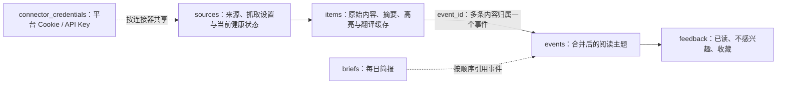
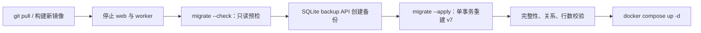

# SQLite 结构精简与安全迁移说明

> 状态：已批准实施
>
> 适用版本：数据库结构 v7
>
> 适用场景：单用户、Docker 部署、宿主机持久化 SQLite 的 NewsRSSHub

## 1. 本次改动的边界

本次不是清空数据库，也不会从本地数据库覆盖服务器数据库。

服务器上的真实 SQLite 文件始终是唯一数据源。代码发布后，通过镜像内置的迁移命令在服务器数据目录上完成预检、备份和迁移；普通 `web`、`worker` 启动不会静默执行删表或重建表操作。

本次保留已经实现的产品能力：来源管理、平台凭证、X Cookie 动态维护、LLM 连接配置、内容摘要与高亮、正文中文翻译、事件合并、四个内容 Tab、已读、不感兴趣、日报与批量来源导入。

“收藏”不新增一张表。后续页面增加收藏按钮时，复用 `feedback.action = saved`。

## 2. 为什么需要精简

旧结构有 9 张业务表、92 个字段。实际检查确认存在三类问题：

1. `items.event_id` 与 `event_items` 保存了同一份关系，而业务规则已经明确一条内容只能属于一个事件。
2. `fetch_runs` 会随每个抓取轮次无限增长；来源表本身已保存当前健康状态、最近抓取时间、最近成功时间和最近错误。
3. 部分字段只是历史遗留或未被任何运行路径读取，例如来源备用链接、事件指纹、原始 JSON。

这次精简追求的是单一事实来源和可维护性，不以“表越少越好”为目标。摘要、翻译、内容哈希、连接器状态和平台凭证仍是当前功能必须的数据，不能因为当前数据为空而删除。

## 3. v7 目标数据模型



| 表 | 职责 | 关键约束 |
| --- | --- | --- |
| `sources` | 来源身份、抓取频率、启停、归档与当前健康状态 | `UNIQUE(kind, locator)`；`config_json` 只存非敏感连接器缓存，例如 X 的 `x_user_id` |
| `connector_credentials` | 每个平台一份加密 Cookie、API Key 或模型连接配置 | 凭证按 `connector` 主键保存，不绑定单个来源 |
| `items` | 原文、链接、作者、摘要、高亮、翻译及重试状态 | `UNIQUE(source_id, guid)`；通过 `event_id` 归入零或一个事件 |
| `events` | 合并后的阅读主题、内容层级、排序和主条目 | `primary_item_id` 指向该事件的主条目 |
| `feedback` | 用户对事件的持久状态 | 复合主键 `(event_id, action)`，支持 `read`、`not_interested`、`saved` |
| `briefs` | 每日简报标题、引言和有序事件列表 | 有序列表保存在 `event_ids_json`，不为小型日报新增关联表 |

### 3.1 保留的关键字段

- `sources.feed_url`：YouTube 等连接器会将可变的 Handle 规范化为稳定抓取地址。
- `sources.config_json`：当前用于缓存 X 用户 ID，未来可承载少量非敏感连接器状态；Cookie 和 API Key 不得存入此字段。
- `items.content_hash`：同一 GUID 的内容被源站修订后，必须重新走摘要和筛选流程。
- 摘要、重点高亮、翻译、状态、错误和版本字段：它们直接支撑中文阅读体验和可重试的模型流水线。
- `feedback`：不能合并成 `events.user_hidden`，否则“已读”和“收藏”没有可靠的持久化位置。

### 3.2 移除的结构

| 移除对象 | 原因 |
| --- | --- |
| `event_items` | 与 `items.event_id` 重复；目标模型是一对多，不是多对多 |
| `fetch_runs` | 当前没有历史运行记录页面；当前状态已在 `sources`，详细故障在 Docker 日志 |
| `curation_runs` | 当前没有消费者；内容和事件本身的状态足以重试与诊断 |
| `sources.fallback_url` | 没有抓取或展示用途，改为未来连接器确有需要时再放入其配置 |
| `items.raw_json` | 只写入不读取；原文、链接、作者和时间已被结构化保存 |
| `events.fingerprint` | 只生成、不参与查询或事件合并 |
| `events.source_count` | 可从关联的 `items` 实时计算，避免缓存不一致 |
| `events.curation_version`、`created_at`、`updated_at` | 当前不参与任何业务判断；保留 `first_seen_at`、`last_seen_at`、`curated_at` 即可 |
| `feedback.id`、`feedback.source_id` | 所有反馈均以事件为单位；复合主键足够表达状态 |

## 4. 索引策略

- 保留 SQLite 自动创建的 `UNIQUE(source_id, guid)` 索引；删除重复的 `idx_items_source_guid`。
- 保留 `items(event_id)`，用于事件详情和来源数统计。
- 保留事件阅读和跨批次上下文所需的事件索引。
- `feedback` 使用主键索引，不再额外建立重复索引。
- `fetch_runs`、`curation_runs` 删除后，对应索引一并删除。
- 不为当前几十到几千条内容预先堆叠猜测性索引；摘要/翻译任务的索引仅在真实负载证明需要时再调整。

## 5. 数据保留策略

本次结构迁移不自动清理任何正常资讯内容。保留期作为后续独立功能上线，避免把“改表”和“删除历史内容”混在一次操作中。

拟定默认规则如下：

- 普通 `items`、`events`、`briefs`：30 天，与现有阅读时间范围保持一致。
- 收藏的事件及其关联内容：不自动清理。
- `sources` 与 `connector_credentials`：不自动清理。
- 若未来需要保留 90 天日报，则关联事件和内容也要一并保留 90 天，不能保留指向已删除事件的日报。

## 6. 服务器安全迁移流程

迁移通过项目内置命令执行，不要求在服务器手工运行 SQL，也不把本地 SQLite 文件传到服务器。



若使用 Portainer Git Stack，`/home/jzb/docker/rss-hub` 只保存 `data/` 等宿主机挂载数据，不是 Git 工作目录，因此不要在这里执行 `git pull`。代码更新由 Portainer 拉取 GitHub 的最新提交并构建镜像。

首次迁移时，先在 Portainer 部署包含迁移修复的最新提交，让新镜像构建完成；旧结构数据库会让 Web/Worker 拒绝启动，但不会修改数据。随后在服务器终端使用这次构建出的镜像执行维护命令。例如镜像名为 `newsrsshub-migrate:20260804` 时：

```bash
docker run --rm -v /home/jzb/docker/rss-hub/data:/app/data newsrsshub-migrate:20260804 python -m app.migrate --check
docker run --rm -v /home/jzb/docker/rss-hub/data:/app/data newsrsshub-migrate:20260804 python -m app.migrate --apply
```

两条命令都必须保持单行。`--apply` 成功后，在 Portainer 再次部署该 Stack，使 Web 和 Worker 使用已完成迁移的数据库正常启动。

如果服务器上确实有项目源码和 Compose 文件，才使用以下 Compose 方式：

```bash
cd /home/jzb/docker/rss-hub
git pull
docker compose down
docker compose --profile maintenance build migrate
docker compose --profile maintenance run --rm migrate --check
docker compose --profile maintenance run --rm migrate --apply
docker compose up -d --build
```

`--check` 只读检查以下内容：

- `PRAGMA integrity_check` 与 `foreign_key_check`；
- 当前版本和目标版本；
- `items.event_id` 与旧 `event_items` 是否完全一致；
- 事件主条目、来源与凭证关系是否完整；
- 日报 JSON 是否可解析；旧库中仅指向已删除事件的日报引用会列为“自动移除”项，不阻断迁移；
- 本次要保留和丢弃的数据规模。

`--apply` 的顺序：

1. 用 SQLite `backup()` API 在容器的 `/app/data/backups/` 创建带时间戳备份（对应宿主机 `/home/jzb/docker/rss-hub/data/backups/`）；不直接复制 WAL 工作中的 `.db` 文件。
2. 再次执行预检，失败即中止。
3. 在同一事务中创建 v7 表、按主键复制保留数据；对于旧日报，仅移除指向不存在事件的 ID，保留日报行、其余有效 ID 及原有顺序。
4. 重建索引、删除旧结构、写入 `PRAGMA user_version = 7`。
5. 迁移后复核行数、外键、事件关系、X 配置缓存与加密凭证记录。
6. 失败时回滚数据库事务；已创建的备份保留用于人工恢复。

普通应用启动仅允许两种情况：空数据库初始化为 v7，或数据库已经是 v7。遇到旧版本会拒绝启动并提示先运行迁移命令，避免在 Web 服务启动过程中悄悄做不可逆重建。

## 7. 发布后验证与回滚

迁移完成后应确认：

1. `/health` 可访问。
2. 来源数量、内容数量、事件数量、日报数量与迁移前预检输出一致。
3. X Cookie、模型连接仍显示已配置，但页面和日志绝不显示密文。
4. 来源管理、事件详情、摘要展开、已读和“不感兴趣”正常。
5. Worker 能正常完成一轮抓取、摘要、筛选和翻译。

如需回滚：停止服务，使用迁移命令输出的备份恢复 `rss_news.db`，再部署旧版镜像。不要在仍运行的 WAL 数据库上直接覆盖单个 `.db` 文件。

## 8. 本次代码落地范围

- `Database.initialize()` 只接受空库或完整 v7；旧库会给出迁移提示，不会在 Web/Worker 启动时改表。
- `app.migrate` 提供 `--check`（SQLite `mode=ro` 只读连接）与 `--apply`（backup API 备份、单事务迁移、迁移后校验）。命令输出只含版本和行数，不输出任何凭证。
- 对旧库日报中仅有的失效事件引用，`--check` 会明确显示可自动移除数量，`--apply` 才会在备份后的事务中修复；无法解析的日报 JSON 仍会拒绝迁移。已是 v7 的数据库不会被普通运行时或迁移命令静默改写。
- `docker-compose.yml` 的 `migrate` 是独立 `maintenance` profile；常规 `docker compose up -d` 不会执行它。
- 仓储层以 `items.event_id` 作为事件归属唯一事实来源，来源数在读取时动态统计；抓取和筛选保留来源当前状态与条目重试状态，不再写无限增长的运行历史。
- 来源表单与导入模型不再暴露未使用的备用链接；`FeedItem.raw` 仍可供连接器在内存中解析，但不会再写入 SQLite。
- 自动化测试覆盖：空库初始化、旧库拒绝普通启动、只读预检、备份后的显式迁移、关系不一致阻断，以及 v7 外键/索引/完整性检查。
