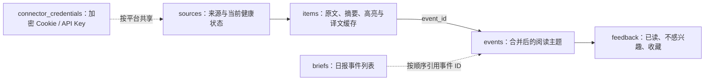

# SQLite v7 结构与部署边界

> 状态：当前固定结构
>
> 适用场景：单用户、Portainer Git Stack、宿主机持久化 SQLite

## 1. 当前策略

NewsRSSHub 现在固定使用 SQLite v7。

- 空数据目录首次启动时自动创建 v7 数据库；
- 已有 v7 数据库只校验结构，不会删表、改表或重建数据；
- 已完成的 v6 → v7 升级是一次性历史操作，迁移命令、迁移容器和 `--check` / `--apply` 逻辑均已移除；
- 如果检测到旧版本数据库，应用会明确拒绝启动，不会在普通 Portainer 部署中猜测如何修改历史数据。

这样日常部署只有一条路径：在 Portainer 的主 Stack 页面点击“从 Git 仓库重新部署”。

## 2. v7 数据模型



| 表 | 职责 | 关键约束 |
| --- | --- | --- |
| `sources` | 来源身份、抓取频率、启停、归档与当前健康状态 | `UNIQUE(kind, locator)` |
| `connector_credentials` | 每个平台一份加密 Cookie、API Key 或模型连接配置 | 凭证按 `connector` 主键保存 |
| `items` | 原文、链接、作者、摘要、高亮、翻译及重试状态 | `UNIQUE(source_id, guid)`；最多归入一个事件 |
| `events` | 合并后的阅读主题、内容层级、排序和主条目 | `primary_item_id` 指向主条目 |
| `feedback` | 已读、不感兴趣、收藏状态 | 复合主键 `(event_id, action)` |
| `briefs` | 每日简报标题、引言和有序事件列表 | 有序 ID 列表保存在 `event_ids_json` |

`items.event_id` 是内容归属的唯一事实来源；不再保存重复的 `event_items` 关系。`fetch_runs`、`curation_runs`、来源备用链接、原始 JSON 和其他未使用字段均不在 v7 中保留。

## 3. Portainer 日常部署

主 Stack 名称为 `new-rss-hub`，Git 仓库 Compose 文件为 `docker-compose.yml`。它只启动两个长期服务：

- `web`：网页、设置与读取接口，宿主机端口为 `8188`；
- `worker`：抓取、摘要、筛选、翻译和来源快照。

SQLite 与来源快照均通过宿主机目录持久化：

```text
/home/jzb/docker/rss-hub/data/
├── rss_news.db
├── backups/
└── source_backups/
```

更新代码时，在 Portainer 打开该 Stack，点击“从 Git 仓库重新部署”。不要在 `/home/jzb/docker/rss-hub` 执行 `git pull`：该目录只用于持久化数据，并没有项目源码。

如果页面提示“Stack 已在运行”，表示服务已经存在；应查看容器状态或使用“从 Git 仓库重新部署”，不要反复点击“启动此堆栈”。

## 4. 一次性升级记录

2026-08-04 已完成 v6 → v7 升级：65 个来源、802 个事件、1675 条内容、2 份日报、33 条反馈和 1 份平台凭证均已保留；仅清除了日报中 1 个指向不存在事件的引用。升级前创建的 SQLite 一致性备份保存在宿主机 `data/backups/` 目录。

这不是日常功能。由于项目只供当前单用户使用，升级完成后移除了全部临时迁移代码，避免它继续干扰 Portainer 的普通部署和维护。

## 5. 来源配置备份

来源管理页可导出完整来源 YAML；Worker 首次运行及之后每满 3 天会生成一份自动快照，宿主机位置是 `/home/jzb/docker/rss-hub/data/source_backups/`，仅保留最新 5 份。

来源 YAML 可直接回传到网页的“批量添加”入口；不会包含 Cookie、API Key、模型密钥、抓取状态或资讯内容。它用于恢复来源配置，不替代 SQLite 数据库备份。
